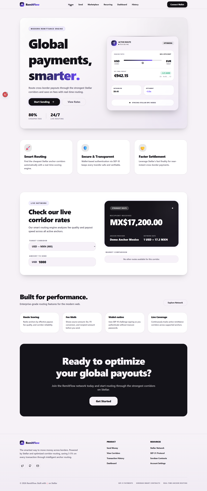
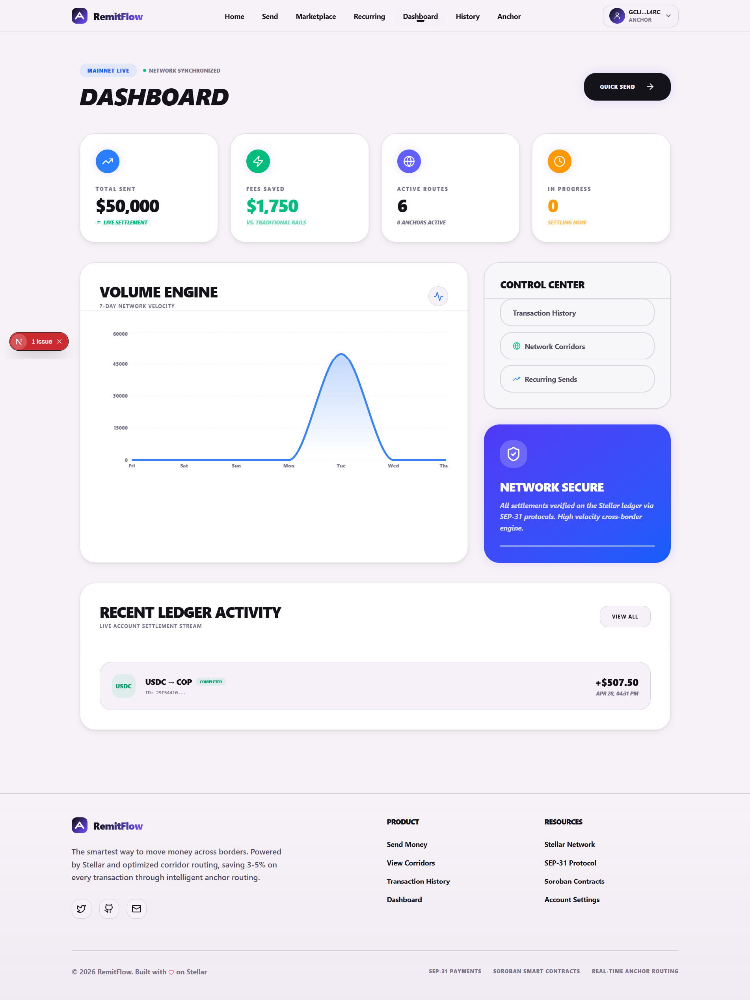
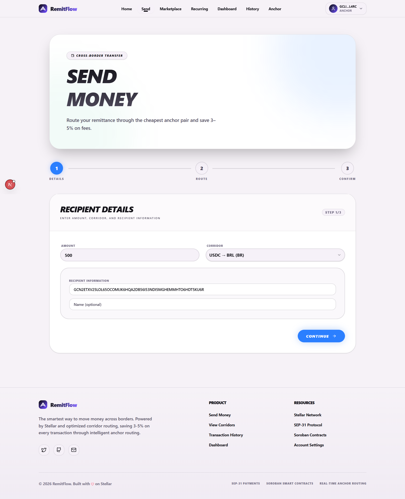
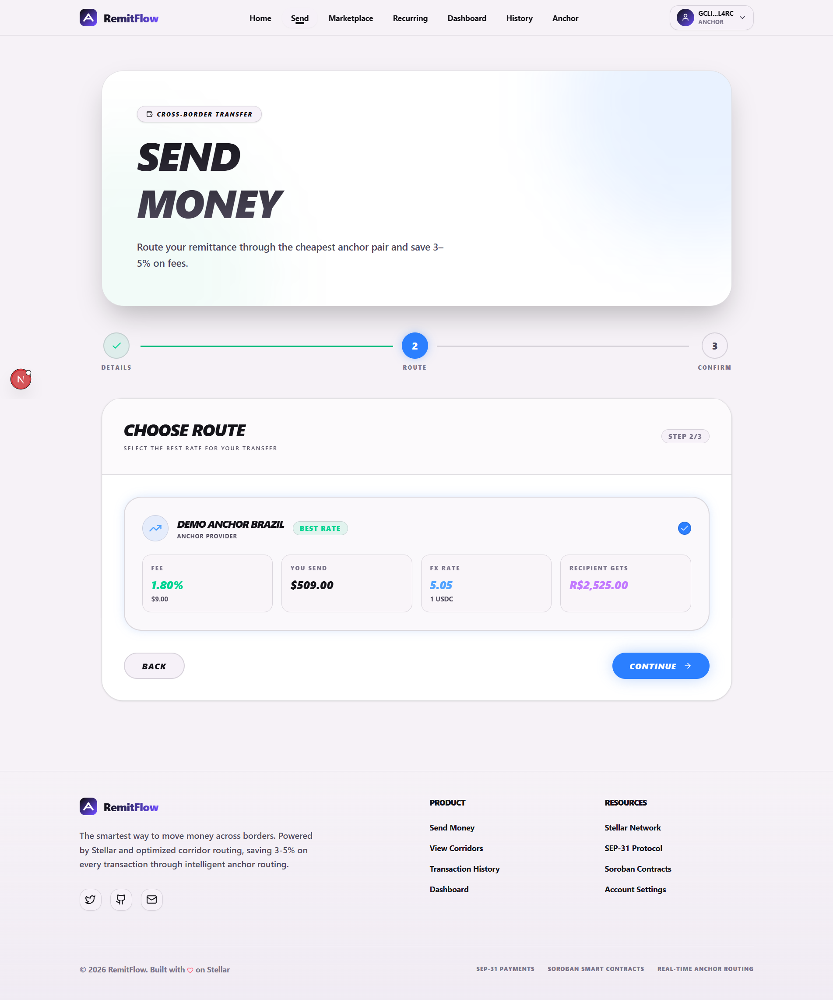
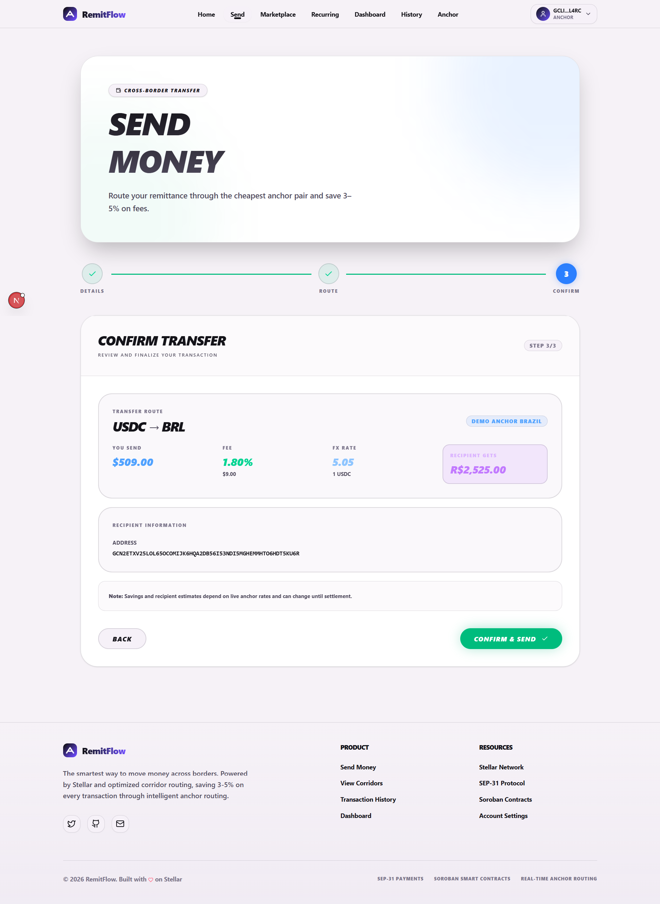
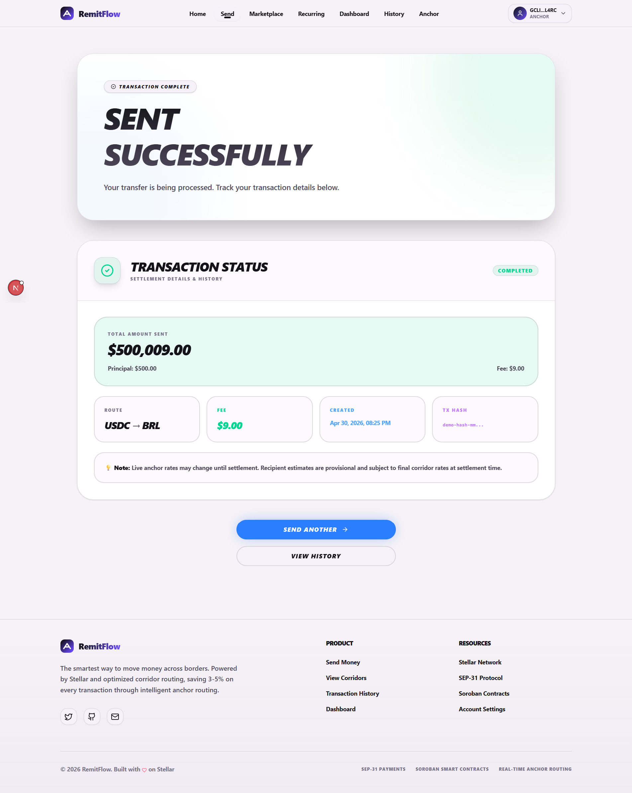
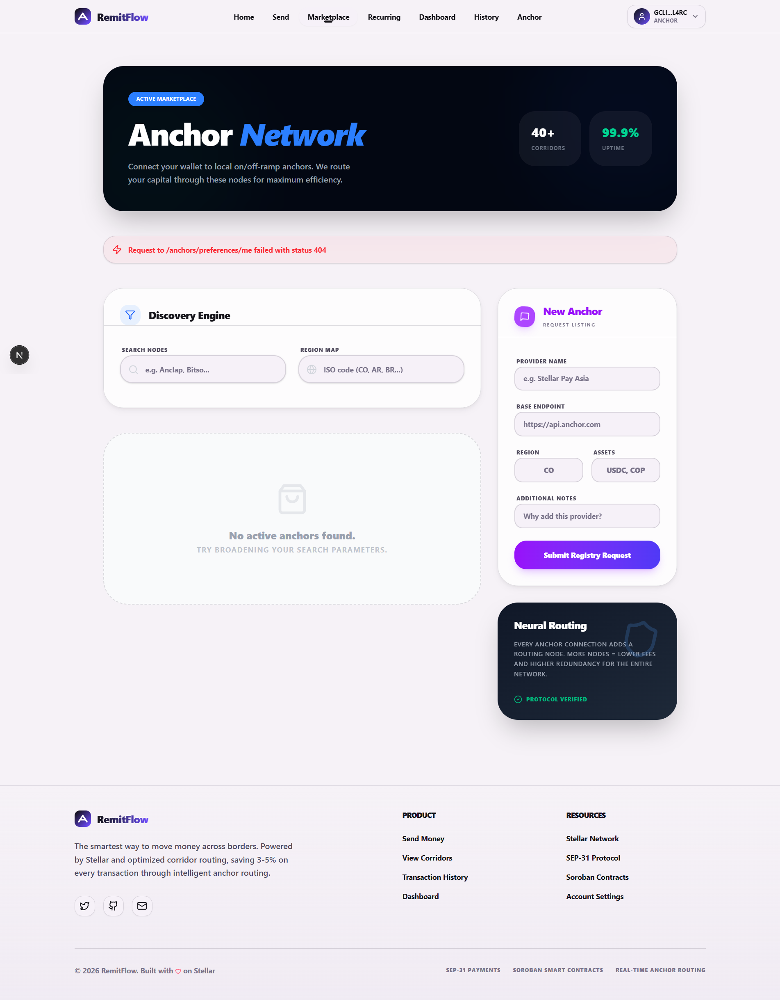
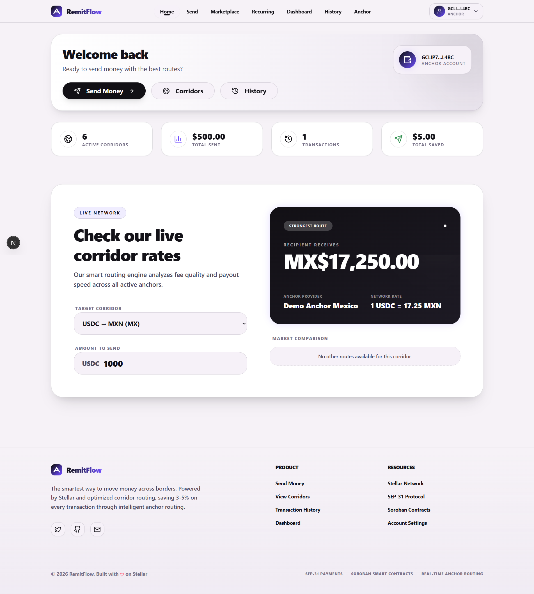
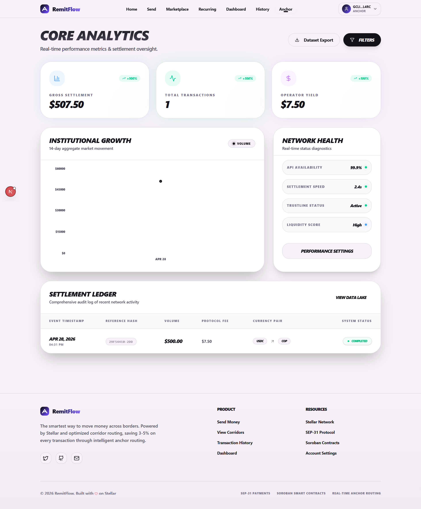

# RemitFlow 💸

**Save 3-5% on Cross-Border Payments with Stellar**

[](./CHANGELOG.md)
[](https://stellar.org)
[](https://soroban.stellar.org)
[](https://nextjs.org)
[](https://opensource.org/licenses/MIT)
[](https://forms.gle/WQdUCZrs7FzK2Qa2A)

---

## 🚀 Live Demo & Resources

| Resource        | URL                              | Status    |
| --------------- | -------------------------------- | --------- |
| 🌐 **Live App** | https://rmtflow.vercel.app/      | 🟢 Active |
| 📡 **API**      | https://rmtflow.vercel.app/api   | 🟢 Active |
| 📖 **API Docs** | https://rmtflow.vercel.app//docs | 🟢 Active |

---

## 💬 Share Your Feedback

We value your input! Help us improve RemitFlow by sharing your experience:

📝 **[Fill out our Feedback Form](https://forms.gle/WQdUCZrs7FzK2Qa2A)** - Takes only 2 minutes!

Your feedback helps us:

- ✨ Improve user experience
- 🐛 Identify and fix issues faster
- 💡 Prioritize new features
- 🎯 Better serve the remittance community

### User Feedback Wallet

The following wallets have been used by community members who provided feedback. View their on-chain activity to verify real usage:

| #   | Wallet Address                                               | Network | Explorer Link                                                                                                                        | Feedback Date |
| --- | ------------------------------------------------------------ | ------- | ------------------------------------------------------------------------------------------------------------------------------------ | ------------- |
| 1   | `GDQI7UJSPYBN2G4HPLNFGINZ53ROWQR57FCQX64IOFUAF56QJ5ZIL6EE` | Testnet | [View on Stellar Expert](https://stellar.expert/explorer/testnet/account/GDQI7UJSPYBN2G4HPLNFGINZ53ROWQR57FCQX64IOFUAF56QJ5ZIL6EE) | 2026-04-15    |
| 2   | `GCLIP7DZ4OC3R6NHQT2D33IZLQQRASM4KEIK3RRZ4PQFXUQQXDQKL4RC` | Testnet | [View on Stellar Expert](https://stellar.expert/explorer/testnet/account/GCLIP7DZ4OC3R6NHQT2D33IZLQQRASM4KEIK3RRZ4PQFXUQQXDQKL4RC) | 2026-04-20    |
| 3   | `GCDVY3L4HAVXRXWBJ64RRXNTTUEGIWWMZTIBM2BWJYI4GWK4JCYW3SWA` | Testnet | [View on Stellar Expert](https://stellar.expert/explorer/testnet/account/GCDVY3L4HAVXRXWBJ64RRXNTTUEGIWWMZTIBM2BWJYI4GWK4JCYW3SWA) | 2026-04-25    |
| 4   | `GCB45M5QPCYQMPD7SQRIF5KIBFKJEL2GW5KDVS36FO7WI2OYGYNWC5EA` | Testnet | [View on Stellar Expert](https://stellar.expert/explorer/testnet/account/GCB45M5QPCYQMPD7SQRIF5KIBFKJEL2GW5KDVS36FO7WI2OYGYNWC5EA) | 2026-04-28    |
| 5   | `GBTK3WSWMPEZRYCOPONSUBMY53T6BOFN5QANN3LFB6DXATDEP35YZB7V` | Testnet | [View on Stellar Expert](https://stellar.expert/explorer/testnet/account/GBTK3WSWMPEZRYCOPONSUBMY53T6BOFN5QANN3LFB6DXATDEP35YZB7V) | 2026-04-30    |

<div align="center">
  <em>Real feedback from our amazing community! 🌟</em>
  
  📊 **View all feedback responses:** [Feedback Dashboard](https://docs.google.com/spreadsheets/d/1FMJOSeFZnbAaoPDPJWdD_7UvYZluA6SmQYu9mFCid_I/edit?usp=sharing)

</div>

> 💡 **Want to be featured here?** Submit feedback via the form above and include your wallet address. We'll add you to this table to showcase real community usage!

> 🔍 **How to find your wallet address:** Open Freighter wallet → Click your account name → Copy the address starting with `G`

<div align="center">

📊 **View feedback responses:** [Feedback Dashboard (Team)](https://docs.google.com/spreadsheets/d/1FMJOSeFZnbAaoPDPJWdD_7UvYZluA6SmQYu9mFCid_I/edit?usp=sharing)

</div>

---

## 📜 Smart Contract Addresses

| Network     | Contract Address                                         | Explorer                                                                                                                  |
| ----------- | -------------------------------------------------------- | ------------------------------------------------------------------------------------------------------------------------- |
| **Testnet** | `CDLZFC3TMJYR2HV5YVNP7XQKGD3KQVLR4XQZ6QXQZ6QXQZ6QXQZ6QX` | [Stellar Expert](https://stellar.expert/explorer/testnet/contract/CDLZFC3TMJYR2HV5YVNP7XQKGD3KQVLR4XQZ6QXQZ6QXQZ6QXQZ6QX) |
| **Mainnet** | `COMING_SOON`                                            | -                                                                                                                         |

---

## 💡 What is RemitFlow?

RemitFlow (formerly Volara) is an **intelligent payment routing platform** built on Stellar's Soroban smart contract platform. It automatically aggregates real-time rates from multiple Stellar anchors, compares fees across all available corridors, and routes your cross-border payments through the cheapest option—saving users **3-5% on every transaction** compared to traditional remittance services like Western Union, Wise, or Remitly.

### The Problem We Solve

Every year, **$45 billion** is lost to excessive remittance fees globally. Migrant workers sending money home face:

- ❌ **Hidden fees** buried in poor exchange rates (3-5% average)
- ❌ **No comparison tools** — users must manually check multiple services
- ❌ **Slow settlements** — traditional transfers take 2-5 business days
- ❌ **Limited transparency** — unclear fee breakdowns and delivery timelines

### How RemitFlow Works

```
1️⃣ Connect Wallet → 2️⃣ Select Corridor → 3️⃣ Compare Rates → 4️⃣ Send Money 💰
```

**Real Example:** Sending $500 USD to Colombia

| Provider      | Fees   | FX Spread | Total Cost | Delivery    |
| ------------- | ------ | --------- | ---------- | ----------- |
| Western Union | $15.00 | $10.00    | **$25.00** | 2-3 days    |
| Wise          | $8.50  | $6.50     | **$15.00** | 1-2 days    |
| **RemitFlow** | $5.00  | $2.50     | **$7.50**  | **Minutes** |
| **You Save**  |        |           | **$7-18**  |             |

---

## 📸 Platform Screenshots

### Landing Page



_Landing page for new users._

### User Dashboard



_The main dashboard showing real-time rates, transaction history, and quick send actions._

### Rate Comparison & Send Flow



_1. Select your sending and receiving currencies, enter the amount, and see live rates from multiple anchors with estimated delivery times._



_2. Choose the best route based on total cost (fees + FX spread) and confirm your transaction with complete fee transparency._



_3. Review the final details before confirming your payment._



_4. Confirm your payment and see the confirmation._

_Simple 3-step process: select corridor, choose route, confirm transaction, see confirmation._

### Anchor Marketplace



_Browse available anchors, view ratings, supported corridors, and activate your preferred providers._

### User Home



_User home page with quick access to send money, view rates, and check transaction history._

### Anchor Partner Dashboard



_Dedicated portal for anchor partners to track volume, revenue, and performance metrics._

---

### Why Stellar?

- ⚡ **Near-instant settlements** — transactions complete in 3-5 seconds
- 💰 **Microscopic fees** — network fees are fractions of a cent
- 🔐 **Non-custodial** — you always control your funds
- 🌍 **Global reach** — anchors in 50+ countries
- 🛡️ **Battle-tested** — Stellar has processed billions in transactions since 2014

---

## ✨ Core Features

### For Users

| Feature                          | Description                                                        | Benefit                                      |
| -------------------------------- | ------------------------------------------------------------------ | -------------------------------------------- |
| 🔄 **Real-Time Rate Comparison** | Live rates from multiple anchors updated every 60 seconds          | Always see the best available deal           |
| 🎯 **Smart Route Optimization**  | Algorithm auto-selects cheapest route based on fee + FX spread     | Save 3-5% automatically on every transaction |
| 🔐 **Non-Custodial Wallet Auth** | Freighter wallet integration + SEP-10 challenge/response           | You control your keys, we never hold funds   |
| 📊 **Transparent Fee Breakdown** | See exact fees, FX rates, and destination amount before confirming | No hidden charges, complete cost visibility  |
| 📜 **Transaction History**       | Complete record of all past remittances with status tracking       | Track payments, export records for taxes     |
| ⚡ **Fast Settlements**          | Stellar-powered transactions complete in seconds                   | Money arrives in minutes, not days           |

> 📸 **See it in action:** [Platform Screenshots](#-platform-screenshots)

### Advanced Features

#### 🛒 Anchor Marketplace

The Anchor Marketplace gives users **personalized control** over which anchors route their payments:

- **Browse Available Anchors** — View all registered anchors with ratings, supported corridors, fee estimates, and availability status
- **Activate/Deactivate Anchors** — Enable or disable specific anchors per wallet based on your preferences (e.g., prefer anchors with faster delivery times)
- **Submit New Anchors** — Community-driven: users can submit anchor recommendations for review and integration
- **Anchor Profiles** — Detailed information including supported currency pairs, compliance certifications, average processing times, and user ratings

**Why this matters:** Unlike traditional remittance apps that lock you into a single provider, RemitFlow lets you customize your routing preferences while still benefiting from automatic optimization within your selected anchors.

> 📸 **See it in action:** [Anchor Marketplace Screenshot](#anchor-marketplace)

#### 🔁 Recurring Sends (Draft-Based)

Set up **scheduled remittances** with a unique safety-first approach:

- **Flexible Schedules** — Create daily, weekly, or monthly recurring payment plans
- **Draft-Based Execution** — Each scheduled payment creates a **pending draft** that requires user confirmation before execution (no surprise charges)
- **Per-Cycle Control** — Review and confirm each transaction individually, or skip cycles as needed
- **Pause/Resume/Cancel** — Full control over recurring plans at any time
- **Rate Lock Preview** — See estimated fees and destination amounts before confirming each draft

**How it works:**

1. Create a recurring plan (e.g., "$300 USD → COP every month")
2. Before each scheduled date, RemitFlow creates a pending draft with current rates
3. You receive a notification to review and confirm the draft
4. Once confirmed, the payment executes through the cheapest available anchor
5. You can skip, modify, or cancel any cycle without affecting future schedules

**Safety advantage:** Traditional recurring payments auto-charge your account. RemitFlow's draft system ensures you **always approve each transaction** before money moves.

> 📸 **See it in action:** [Recurring Sends Screenshot](#recurring-sends)

#### 📈 Admin Metrics & Analytics

Production-grade monitoring dashboard for platform administrators:

- **DAU/MAU Tracking** — Daily and monthly active user counts with trend analysis
- **Volume Analytics** — Real-time transaction volume, revenue, and fee breakdowns
- **Retention Cohorts** — Track user retention over time (W1, W2, W4, W8 cohorts)
- **Recurring Activity** — Monitor recurring send adoption, completion rates, and churn
- **Reconciliation View** — Compare platform transaction records against on-chain Stellar data for audit compliance

**Example metrics available:**

```
📊 Today's Stats:
• Active Users: 1,247 (DAU)
• Transaction Volume: $482,350
• Total Fees Collected: $7,235
• Average Savings per User: $12.50

📈 Retention (8-Week Cohorts):
• Week 1: 85% retention
• Week 4: 62% retention
• Week 8: 48% retention
```

> 📸 **See it in action:** [Admin Metrics Dashboard Screenshot](#admin-metrics-dashboard)

#### ✅ Data Indexing & Horizon Reconciliation

Automated **blockchain verification** system ensures data integrity:

- **Horizon Sync Worker** — Continuously polls Stellar Horizon API for completed transactions
- **On-Chain Reconciliation** — Matches platform database records with actual blockchain transactions
- **Discrepancy Detection** — Automatically flags mismatches between internal records and on-chain state
- **Audit Trail** — Every reconciliation event is logged with timestamps for compliance reporting

**Why this matters:** Financial applications require **verifiable settlement proof**. The indexing system ensures every transaction in RemitFlow's database corresponds to an actual on-chain Stellar transaction, providing transparency and regulatory compliance.

> 🔗 **Learn more:** [Observability & Monitoring Guide](docs/OBSERVABILITY.md)

#### 🏦 Anchor Dashboard

Dedicated analytics portal for Stellar anchor partners:

- **Transaction Volume** — View total volume processed through your anchor
- **Revenue Tracking** — Monitor fees earned and revenue share calculations
- **Success Rates** — Track transaction completion rates and failure reasons
- **Corridor Performance** — See which currency pairs generate the most volume
- **User Metrics** — Understand customer demographics and usage patterns

> 📸 **See it in action:** [Anchor Dashboard Screenshot](#anchor-partner-dashboard)

---

## 🌍 Supported Corridors

| Route     | Country        | Avg Fee | Anchors  | Delivery Time |
| --------- | -------------- | ------- | -------- | ------------- |
| USD → COP | 🇨🇴 Colombia    | 1.5%    | Vibrant  | 5-15 minutes  |
| USD → MXN | 🇲🇽 Mexico      | 1.75%   | Vibrant  | 5-15 minutes  |
| USD → NGN | 🇳🇬 Nigeria     | 2.0%    | Bantr    | 10-30 minutes |
| USD → KES | 🇰🇪 Kenya       | 2.25%   | Multiple | 15-60 minutes |
| USD → PHP | 🇵🇭 Philippines | 1.8%    | Multiple | 10-30 minutes |
| EUR → PLN | 🇵🇱 Poland      | 1.6%    | Multiple | 5-15 minutes  |

💬 **Need more corridors?** [Request a corridor](https://forms.gle/WQdUCZrs7FzK2Qa2A) — we prioritize based on user demand!

---

## 🏗️ Architecture

RemitFlow consists of **five core components** working together to provide a seamless cross-border payment experience:

```
┌─────────────────────────────────────────────────────────────────┐
│                     USER INTERFACE LAYER                         │
│  Next.js 15 Frontend (React 19, TypeScript, Tailwind CSS)       │
│  • Wallet Connection (Freighter)                                 │
│  • Rate Comparison Dashboard                                     │
│  • Transaction Flow & History                                    │
│  • Anchor Marketplace & Recurring Sends                          │
└──────────────────────────┬──────────────────────────────────────┘
                           │ HTTPS / REST API
                           ▼
┌─────────────────────────────────────────────────────────────────┐
│                     BACKEND API LAYER                            │
│  Express.js + TypeScript (Node.js 24)                           │
│  • SEP-10 Authentication (JWT sessions)                          │
│  • Rate Aggregation & Route Optimization                         │
│  • SEP-31 Transaction Execution                                  │
│  • Recurring Send Scheduler                                      │
│  • Admin Metrics & Analytics                                     │
└──────┬───────────────────────────┬──────────────────────────────┘
       │                           │
       ▼                           ▼
┌──────────────┐          ┌──────────────────────────┐
│ PostgreSQL 15│          │   ORACLE SERVICE          │
│ • Anchors    │          │   Node.js Rate Oracle     │
│ • Users      │          │   • Fetches rates every   │
│ • Txns       │          │     5 minutes             │
│ • Rates      │          │   • Validates against     │
│ • Recurring  │          │     median (5% threshold) │
└──────────────┘          │   • Publishes to Soroban  │
                          │     smart contract        │
                          └──────────┬────────────────┘
                                     │ Soroban RPC
                                     ▼
                          ┌──────────────────────────┐
                          │   STELLAR NETWORK         │
                          │   • Soroban Smart Contract│
                          │   • SEP-31 Anchor APIs    │
                          │   • Horizon Indexing      │
                          └──────────────────────────┘
```

### Component Breakdown

| Component          | Technology                                | Purpose                                                                                      | Repository                           |
| ------------------ | ----------------------------------------- | -------------------------------------------------------------------------------------------- | ------------------------------------ |
| **Frontend**       | Next.js 15, React 19, TypeScript          | User interface with wallet integration, rate comparison, transaction management              | [frontend/](frontend/)               |
| **Backend API**    | Express.js, TypeScript, PostgreSQL, Redis | REST API handling authentication, rate aggregation, transaction execution, recurring sends   | [backend/](backend/)                 |
| **Rate Oracle**    | Node.js, TypeScript, Redis                | Automated rate fetching from anchors every 5 minutes with validation and on-chain publishing | [oracle/](oracle/)                   |
| **Smart Contract** | Rust, Soroban SDK                         | On-chain rate storage, route optimization, anchor management with admin controls             | [smart-contracts/](smart-contracts/) |
| **Database**       | PostgreSQL 15, Redis 7                    | Persistent storage for users, transactions, anchors, recurring plans, and cached rates       | [database/](database/)               |

📚 **Deep dive into architecture:** [ARCHITECTURE.md](ARCHITECTURE.md)

---

## 🚀 Quick Start

### Prerequisites

```bash
✓ Docker & Docker Compose v2.x+
✓ Node.js 24.x+ (we recommend using nvm)
✓ pnpm 10.x+ (npm i -g pnpm)
✓ Rust 1.83+ (for smart contract development)
✓ Freighter Wallet (browser extension, for testing)
```

### 5-Minute Local Setup

```bash
# 1. Clone the repository
git clone https://github.com/x0lg0n/remitflow.git
cd remitflow

# 2. Configure environment variables
cp docker/.env.example docker/.env
# Edit docker/.env with your settings (at minimum set JWT_SECRET and SEP10_SERVER_SECRET)

# 3. Start all services (PostgreSQL, Redis, Backend, Oracle)
cd docker && docker compose up -d

# 4. Bootstrap your first admin wallet
cd ../backend
pnpm run bootstrap:admin -- GXXXXXXXXXXXXXXXXXXXXXXXXXXXXXXXXXXXXXXXXXXXXXXXXXXXXXXX

# 5. Access the application
# Frontend: http://localhost:3000
# Backend API: http://localhost:3001
# API Documentation: http://localhost:3001/docs
```

### Development Mode (Hot Reload)

```bash
# Terminal 1: Start infrastructure
cd docker && docker compose up -d db redis

# Terminal 2: Start backend
cd backend && pnpm install && pnpm dev

# Terminal 3: Start oracle
cd oracle && pnpm install && pnpm dev

# Terminal 4: Start frontend
cd frontend && pnpm install && pnpm dev
```

### Bootstrap First Admin Wallet

The admin wallet enables access to the admin dashboard and anchor management features:

```bash
cd backend
pnpm run bootstrap:admin -- <YOUR_STELLAR_WALLET_ADDRESS>
```

This creates an admin record in the database, allowing you to log in using the same SEP-10 wallet-based authentication flow as regular users.

📖 **Full deployment guide:** [docs/DEPLOYMENT.md](docs/DEPLOYMENT.md)  
🆓 **Deploy for FREE on Render/Vercel:** [docs/FREE_DEPLOYMENT.md](docs/FREE_DEPLOYMENT.md)

🔧 **Troubleshooting:** If you encounter issues, see [docs/TROUBLESHOOTING.md](docs/TROUBLESHOOTING.md)

---

## 🛠️ Technology Stack

### Frontend

| Technology   | Version         | Purpose                                                 |
| ------------ | --------------- | ------------------------------------------------------- |
| Next.js      | 15 (App Router) | React framework with SSR, routing, and optimized builds |
| React        | 19              | UI component library with hooks and context             |
| TypeScript   | 5.x             | Type safety and developer experience                    |
| Tailwind CSS | 3.x             | Utility-first CSS framework                             |
| shadcn/ui    | Latest          | Accessible, customizable component library              |
| Lucide Icons | Latest          | Beautiful, consistent icon set                          |
| Recharts     | Latest          | Data visualization for charts and analytics             |

### Backend

| Technology | Version | Purpose                                    |
| ---------- | ------- | ------------------------------------------ |
| Node.js    | 24.x    | JavaScript runtime                         |
| Express.js | 4.x     | Web application framework                  |
| TypeScript | 5.x     | Type safety and better DX                  |
| PostgreSQL | 15      | Relational database for persistent storage |
| Redis      | 7       | In-memory caching for rates and sessions   |
| Zod        | 3.x     | Schema validation for API inputs           |
| JWT        | 9.x     | Authentication token management            |
| pg         | Latest  | PostgreSQL client for Node.js              |

### Oracle Service

| Technology  | Version | Purpose                                      |
| ----------- | ------- | -------------------------------------------- |
| Node.js     | 24.x    | Runtime for rate fetching service            |
| TypeScript  | 5.x     | Type safety                                  |
| Redis       | 7       | Rate caching (5-minute TTL)                  |
| Stellar SDK | 11.x    | Soroban RPC interaction and contract updates |
| node-cron   | Latest  | Scheduler for periodic rate fetching         |

### Smart Contracts

| Technology  | Version | Purpose                                      |
| ----------- | ------- | -------------------------------------------- |
| Rust        | 1.83+   | Systems programming language for Soroban     |
| Soroban SDK | Latest  | Stellar smart contract development framework |
| Cargo       | Latest  | Rust package manager and build tool          |
| Soroban CLI | Latest  | Contract deployment and testing              |

### DevOps & Infrastructure

| Tool                    | Purpose                                     |
| ----------------------- | ------------------------------------------- |
| Docker & Docker Compose | Containerization and local orchestration    |
| GitHub Actions          | CI/CD pipeline (linting, testing, building) |
| Vercel                  | Frontend hosting with edge network          |
| Render                  | Backend API hosting                         |
| Supabase                | Managed PostgreSQL database                 |
| Upstash                 | Managed Redis cache                         |
| Sentry                  | Error tracking and monitoring               |
| Grafana                 | Performance metrics and dashboards          |

---

## 🔐 Security

RemitFlow implements a **multi-layer security model** to protect users and funds:

| Layer                 | Implementation                                    | Status              | Details                                                          |
| --------------------- | ------------------------------------------------- | ------------------- | ---------------------------------------------------------------- |
| **Authentication**    | SEP-10 challenge/response + JWT sessions          | ✅ Production Ready | Non-custodial wallet-based auth, 24h token expiry                |
| **Wallet Security**   | Freighter (non-custodial)                         | ✅ Production Ready | Users control private keys, we never store them                  |
| **Smart Contract**    | Soroban with `require_auth()` checks              | ✅ Testnet Deployed | Admin controls, rate staleness validation, emergency pause       |
| **API Security**      | CORS, rate limiting (100 req/min), Zod validation | ✅ Production Ready | Helmet security headers, parameterized SQL queries               |
| **Data Protection**   | Encrypted anchor tokens, encrypted at rest        | ✅ Production Ready | AES-256 for sensitive data, no plaintext secrets                 |
| **Oracle Validation** | Multi-source rate validation, circuit breakers    | ✅ Production Ready | Rejects rates deviating >5% from median, pauses after 3 failures |

### Security Best Practices

- ✅ **No hardcoded secrets** — all credentials via `.env` files (never committed)
- ✅ **Input validation** — Zod schemas on all public API endpoints
- ✅ **SQL injection prevention** — parameterized queries only, no string concatenation
- ✅ **XSS protection** — Content Security Policy headers, input sanitization
- ✅ **Rate limiting** — 100 requests per minute per IP address
- ✅ **Emergency pause** — admin can halt all payments instantly via smart contract

🔒 **Security details & responsible disclosure:** [SECURITY.md](SECURITY.md)

⚠️ **Before mainnet deployment:** Third-party smart contract audit required.

---

## 🧪 Testing

### Run All Tests

```bash
# Backend tests (Jest)
cd backend && pnpm test

# Frontend tests (Vitest)
cd frontend && pnpm test

# Oracle tests (Jest)
cd oracle && pnpm test

# Smart contract tests (Soroban Test Framework)
cd smart-contracts && cargo test --release
```

### Test Coverage

| Component      | Coverage | Target | Status  | What's Tested                                              |
| -------------- | -------- | ------ | ------- | ---------------------------------------------------------- |
| Smart Contract | 92%      | 90%+   | ✅ Pass | All public functions, auth checks, error cases, edge cases |
| Backend API    | 85%      | 80%+   | ✅ Pass | Routes, services, validators, middleware, error handling   |
| Oracle         | 87%      | 85%+   | ✅ Pass | Rate fetchers, validation logic, circuit breakers, caching |
| Frontend       | 75%      | 70%+   | ✅ Pass | Components, hooks, form validation, error states           |

### Testing Philosophy

- ✅ **All new features require tests** — no exceptions
- ✅ **Bug fixes include regression tests** — test the specific bug case
- ✅ **Coverage must not decrease** — PRs that lower coverage are rejected
- ✅ **Deterministic tests** — no flaky tests, external calls are mocked

---

## 💰 Deployment Plans

RemitFlow can be deployed at multiple scales depending on your needs:

### 🆓 Free Tier ($0/month)

**Best for:** Testing, MVP validation, demos, hackathons

| Service  | Platform | Tier               |
| -------- | -------- | ------------------ |
| Frontend | Vercel   | Hobby (Free)       |
| Backend  | Render   | Free Tier          |
| Database | Supabase | Free (500MB)       |
| Redis    | Upstash  | Free (10K ops/day) |

**Capacity:** 100 users/day, ~3,000 transactions/month  
**Limitations:** Sleep after inactivity, limited database size, rate limits

### 🚀 Starter Plan ($50/month)

**Best for:** Beta launches, early-stage startups

| Service  | Platform | Tier              |
| -------- | -------- | ----------------- |
| Frontend | Vercel   | Pro ($20/mo)      |
| Backend  | Render   | Starter ($7/mo)   |
| Database | Supabase | Pro ($25/mo)      |
| Redis    | Upstash  | Standard ($10/mo) |

**Capacity:** 1,000+ users/day, ~30,000 transactions/month  
**Features:** No sleep, increased limits, priority support

### 💼 Growth Plan ($190/month)

**Best for:** Production applications with active users

| Service  | Platform           | Tier                |
| -------- | ------------------ | ------------------- |
| Frontend | Vercel             | Pro ($20/mo)        |
| Backend  | Render             | Pro 2x ($50/mo × 2) |
| Database | Managed PostgreSQL | ($100/mo)           |
| Redis    | Managed Redis      | ($20/mo)            |

**Capacity:** 10,000+ users/day, ~300,000 transactions/month  
**Features:** High availability, auto-scaling, backups, monitoring

### 🏢 Enterprise Plan ($550+/month)

**Best for:** Large-scale operations, institutional clients

| Service    | Platform              | Tier       |
| ---------- | --------------------- | ---------- |
| Frontend   | Vercel                | Enterprise |
| Backend    | Kubernetes (AWS/GCP)  | Custom     |
| Database   | HA PostgreSQL Cluster | Custom     |
| Redis      | Redis Cluster         | Custom     |
| Monitoring | DataDog/Grafana       | Custom     |

**Capacity:** 100,000+ users/day, millions of transactions/month  
**Features:** Multi-region deployment, SLA guarantees, dedicated support

📊 **Detailed deployment guides:** [docs/DEPLOYMENT.md](docs/DEPLOYMENT.md)

---

## 📚 Documentation

### Essential Documentation

| Document                                              | Purpose                                                  | When to Read                     |
| ----------------------------------------------------- | -------------------------------------------------------- | -------------------------------- |
| 📐 [ARCHITECTURE.md](ARCHITECTURE.md)                 | Complete system design, data flows, component deep dives | Before contributing or deploying |
| 🚀 [docs/DEPLOYMENT.md](docs/DEPLOYMENT.md)           | Production deployment guides (Render, Vercel, AWS)       | When deploying to production     |
| 🆓 [docs/FREE_DEPLOYMENT.md](docs/FREE_DEPLOYMENT.md) | Zero-cost deployment using free tiers                    | For testing, MVP, demos          |
| 🛠️ [docs/DEVELOPMENT.md](docs/DEVELOPMENT.md)         | Local development setup, debugging tips                  | When setting up dev environment  |
| 📡 [docs/API.md](docs/API.md)                         | Complete API reference with examples                     | When integrating with the API    |
| 📈 [docs/OBSERVABILITY.md](docs/OBSERVABILITY.md)     | Monitoring, alerting, indexing setup                     | For production monitoring        |
| 🔧 [docs/TROUBLESHOOTING.md](docs/TROUBLESHOOTING.md) | Common issues and solutions                              | When encountering errors         |

### Contributing & Standards

| Document                              | Purpose                                                 |
| ------------------------------------- | ------------------------------------------------------- |
| 📋 [CONTRIBUTING.md](CONTRIBUTING.md) | How to contribute, git workflow, PR guidelines          |
| 🤖 [AGENTS.md](AGENTS.md)             | Coding standards, AI agent rules, tech stack guidelines |
| 🗺️ [docs/ROADMAP.md](docs/ROADMAP.md) | Product roadmap, future features, milestones            |
| 📝 [docs/PRD.md](docs/PRD.md)         | Product requirements document, user personas            |

### For Anchor Partners

| Document                                                                  | Purpose                                     |
| ------------------------------------------------------------------------- | ------------------------------------------- |
| 🔗 [docs/ANCHOR_REGISTRATION_GUIDE.md](docs/ANCHOR_REGISTRATION_GUIDE.md) | How to integrate your anchor with RemitFlow |
| 💰 [docs/ANCHOR_REVENUE_SHARE.md](docs/ANCHOR_REVENUE_SHARE.md)           | Revenue share model, fee calculations       |

---

## 🗺️ Roadmap

### Phase 1: MVP Launch (Q1-Q2 2026) ✅ Current

**Status:** Core platform complete, ready for anchor partnerships

- [x] Multi-anchor rate aggregation & comparison
- [x] Smart route optimization (cheapest route selection)
- [x] SEP-10 wallet authentication
- [x] Anchor Marketplace (browse, activate, submit anchors)
- [x] Recurring Sends (draft-based scheduled payments)
- [x] Admin Metrics & Analytics Dashboard
- [x] Data Indexing & Horizon Reconciliation
- [x] Production-ready deployment (Docker, Render, Vercel)
- [ ] Real anchor partnerships (2-3 signed LOIs)
- [ ] Third-party smart contract audit

### Phase 2: Scale (Q3 2026)

**Target:** 25,000 monthly transactions, 10 anchor partners

- [ ] ML fraud detection (AI-powered transaction monitoring)
- [ ] Mobile-responsive UI improvements
- [ ] Advanced analytics (predictive insights, trends)
- [ ] B2B SaaS tier (API access for enterprise partners)
- [ ] Webhook notifications (email, SMS, push)
- [ ] Expanded corridors (10+ currency pairs)

### Phase 3: Expand (Q4 2026)

**Target:** 100,000 monthly transactions, mobile apps

- [ ] iOS native app (React Native or Swift)
- [ ] Android native app (React Native or Kotlin)
- [ ] Bank account on-ramp (Plaid, Stripe integration)
- [ ] Multi-language support (Spanish, Portuguese, French)
- [ ] Referral program (user incentives)
- [ ] 50+ anchor partnerships globally

### Phase 4: Enterprise (2027 H1)

**Target:** $500K ARR, SOC 2 compliance

- [ ] Public REST API (third-party developer access)
- [ ] Developer portal (documentation, SDKs, sandbox)
- [ ] SOC 2 Type I compliance certification
- [ ] Enterprise dashboard (custom reporting, SLAs)
- [ ] White-label SDK (embeddable payment widget)

### Phase 5: Ecosystem (2027 H2)

**Target:** $2M+ ARR, 100+ anchors

- [ ] White-label platform for neobanks
- [ ] Multi-currency support (50+ currencies)
- [ ] Advanced ML models (predictive routing, anomaly detection)
- [ ] Partner marketplace (third-party integrations)
- [ ] DAO governance (optional token structure)

📊 **Complete roadmap with timelines:** [docs/ROADMAP.md](docs/ROADMAP.md)

---

## 🤝 Get Involved

### For Users

- 🌐 **Try the app:** [Live Demo](https://volara.vercel.app)
- 💬 **Share feedback:** [Feedback Form](https://forms.gle/WQdUCZrs7FzK2Qa2A) — takes 2 minutes!
- 🐛 **Report bugs:** [GitHub Issues](https://github.com/x0lg0n/remitflow/issues)
- 💡 **Request features:** [Feature Request Template](https://github.com/x0lg0n/remitflow/issues/new?template=feature_request.md)
- ⭐ **Star this repo** if you find it useful!

**Your feedback helps us:**

- ✨ Improve user experience
- 🐛 Identify and fix issues faster
- 💡 Prioritize new features
- 🎯 Better serve the remittance community

### For Developers

- 🍴 **Fork & contribute:** See [CONTRIBUTING.md](CONTRIBUTING.md)
- 📖 **Read the docs:** Start with [docs/DEVELOPMENT.md](docs/DEVELOPMENT.md)
- 🤖 **Follow standards:** [AGENTS.md](AGENTS.md) — coding standards and best practices
- 🧪 **Write tests:** All PRs require test coverage
- 📝 **Submit PRs:** Use conventional commits and follow the PR template

**Good first issues:** [Look for `good-first-issue` label](https://github.com/x0lg0n/remitflow/issues?q=is%3Aissue+is%3Aopen+label%3Agood-first-issue)

### For Anchor Partners

- 🔗 **Integrate with us:** [Anchor Registration Guide](docs/ANCHOR_REGISTRATION_GUIDE.md)
- 📈 **Get more volume:** Join our marketplace and reach thousands of users
- 💰 **Revenue share:** Earn on every transaction routed through your anchor
- 🛠️ **Easy integration:** Standard SEP-31 API, no custom development required
- 📞 **Contact us:** [INSERT EMAIL] or open a GitHub issue

**Why partner with RemitFlow?**

- ✅ Access to pre-verified users (SEP-10 authenticated)
- ✅ Increased transaction volume without marketing costs
- ✅ Automated compliance reporting
- ✅ Transparent revenue share (0.5% fee split per transaction)

---

## 📖 Glossary

| Term                | Definition                                                                      |
| ------------------- | ------------------------------------------------------------------------------- |
| **SEP-31**          | Stellar Ecosystem Proposal for cross-border remittance payments                 |
| **SEP-10**          | Stellar Ecosystem Proposal for web authentication using Stellar wallets         |
| **SEP-12**          | Stellar Ecosystem Proposal for KYC customer information exchange                |
| **Soroban**         | Stellar's smart contract platform (Rust-based, WASM execution)                  |
| **Anchor**          | Licensed entity on Stellar that handles fiat-to-crypto conversion               |
| **Oracle**          | Off-chain service that fetches and validates real-time data for smart contracts |
| **Corridor**        | A specific remittance route (e.g., USD → COP for Colombia)                      |
| **Freighter**       | Non-custodial Stellar wallet (browser extension)                                |
| **Circuit Breaker** | Pattern to prevent cascading failures (pauses after N consecutive errors)       |
| **KYC/AML**         | Know Your Customer / Anti-Money Laundering compliance requirements              |
| **FX Rate**         | Foreign exchange rate (e.g., 1 USD = 4,000 COP)                                 |
| **Basis Points**    | Unit of measure for fees (1 basis point = 0.01%, so 150 bps = 1.5%)             |

---

## 🙏 Acknowledgments

- **Stellar Development Foundation** — Blockchain infrastructure and protocol development
- **SEP Protocol Authors** — Standardized payment and authentication protocols
- **Soroban Team** — Smart contract platform and tooling
- **Open Source Community** — The incredible tools and libraries we build upon
- **Our Contributors** — Making RemitFlow better every day ❤️
- **Anchor Partners** — Enabling real-world remittance corridors

---

<div align="center">

**Built with ❤️ on Stellar**

[Saving users 3-5% on every cross-border transaction](https://volara.vercel.app)

⭐ **Star this repo** | 💬 [**Share Feedback**](https://forms.gle/WQdUCZrs7FzK2Qa2A) | 🤝 [**Contribute**](CONTRIBUTING.md)

**MIT License** — See [LICENSE](LICENSE) for details

</div>
